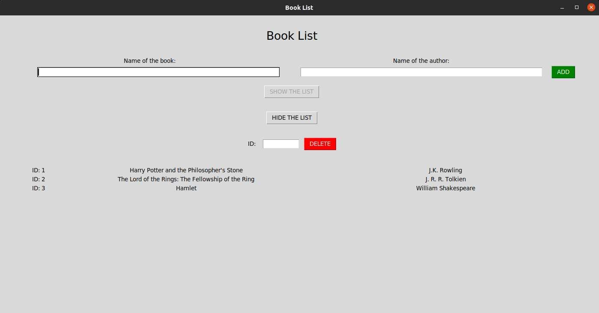

# BookList
This is a desktop application to store books for future read. The reason for me to make this is because I myself am a big reader. Another reason is to practise Tkinter and SQLite3 database. I hope you somehow find it interesting too.

# Tools:
Python 3.8.5, module Tkinter, SQLite3 database

# How it looks like:

# License
The code is available under the [MIT](LICENSE) license.
